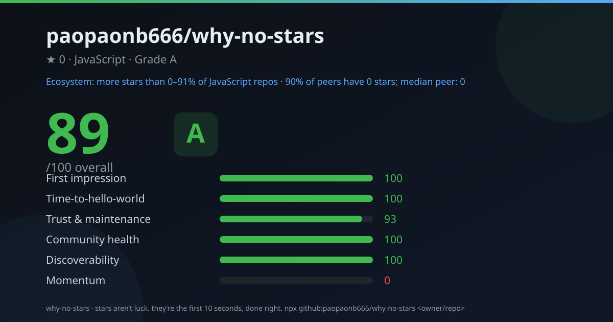

<div align="center">

# 🔍 why-no-stars

**Find out why your repo isn't getting stars — with evidence, not vibes.**

32 checks across six pillars · ecosystem star-percentile benchmark · one shareable scorecard.
Zero dependencies. Zero config. No API key required.

[](https://github.com/paopaonb666/why-no-stars/actions/workflows/ci.yml)
[](./LICENSE)
[](./package.json)
[](./package.json)
[](https://github.com/paopaonb666/why-no-stars/stargazers)



[English](#english) · [中文文档](./README.zh-CN.md)

</div>

---

<a name="english"></a>

## The pitch

You built something good. It works, it's tested, you pushed it with pride.
It has **47 stars**. (Fourteen are your teammates. We counted.)

**Your problem isn't promotion. It's the first 10 seconds.**
A visitor lands on your repo, skims for a reason to care, and bounces. `why-no-stars` makes an evidence-backed guess at where they're bouncing — every finding cites the line, count, or date it came from:

```text
  ⚡ Top fixes
  1. [+3.9 pts] Install command near the top
     First installable command at line 62
     → Move the copy-paste install one-liner into the first screen of the README.
  2. [+3.9 pts] Hero image / GIF above the fold
     Only badge images found — no real screenshot/demo/hero.
     → Put a screenshot/GIF/demo within the first ~40 lines.
  3. [+2.0 pts] Issue template
     No issue template.
     → Add .github/ISSUE_TEMPLATE with bug + feature forms.
```

You can disagree with the diagnosis — but you can't ignore it, because each item shows its evidence.

## Quick start

```bash
# no install needed (runs straight from GitHub)
npx github:paopaonb666/why-no-stars <owner/repo>

# or clone & run
git clone https://github.com/paopaonb666/why-no-stars && cd why-no-stars
node bin.js <owner/repo>
```

```bash
npx github:paopaonb666/why-no-stars sindresorhus/got                 # terminal scorecard
npx github:paopaonb666/why-no-stars me/my-project --svg card.svg     # shareable 1200x630 scorecard
npx github:paopaonb666/why-no-stars me/my-project --md report.md     # paste-ready Markdown report
npx github:paopaonb666/why-no-stars me/my-project --zh               # 中文报告
```

> **No API key needed.** Unauthenticated GitHub allows 60 requests/hour (~4 audits).
> Set `GITHUB_TOKEN` for 5,000/hour: `GITHUB_TOKEN=<your-token> npx github:paopaonb666/why-no-stars me/my-project`.
> First-ever run downloads the tool (~30s of npm fetching); every run after that is fast.

## What it measures — six pillars

| Pillar | Weight | The question it answers |
|---|---|---|
| **First impression** | 25 | Would a stranger care in the first 10 seconds? |
| **Time-to-hello-world** | 20 | How fast can someone go from interested to running it? |
| **Trust & maintenance** | 20 | Is this safe to adopt, or a digital ghost town? |
| **Community health** | 15 | Do the first outsiders have roads to arrive on? |
| **Discoverability** | 10 | Can someone searching for this actually find it? |
| **Momentum** | 10 | Is anything arriving, or is it perfectly still? |

Across these pillars it runs **32 checks** — each with a status, evidence, and a concrete fix. Within a pillar every check counts equally, so a single fix moves the overall score by 2.5–5 points — enough to cross a grade band.

**What it does *not* measure: code quality.** This instrument measures how well a repo presents itself to a first-time visitor — the README, the trust signals, the roads in. A brilliant repo can score C; a mediocre one can score A. That's the point: the score is a to-do list for your repo's storefront, not a judgment of your engineering.

Every check's source is ~30 readable lines — [see for yourself](./src/checks).

## The benchmark nobody else gives you: your percentile

Scoring your repo against abstract best practices is easy. `why-no-stars` also tells you **where you stand in your language's ecosystem**. It queries star-bucket totals for your primary language via the GitHub search API (0, 1–2, 3–9, 10–99, 100–999, 1k–10k, 10k+ stars) and reports an honest **range**:

```text
expressjs/express: 93/100 (S) · more stars than 99–100% of peers
me/my-project:     38/100 (F) · more stars than 30–45% of peers
```

A range, because you only know your bucket — we won't invent precision we don't have. For tiny repos the range gets wide, so we append the context that matters: `90% of peers have 0 stars; median peer: 0`.

## Proof it doesn't flatter famous repos

We audited [`sindresorhus/got`](https://github.com/sindresorhus/got) — one of the most polished repos on GitHub — and it still takes home concrete findings:

```text
  Overall  93/100  [S]          Ecosystem: more stars than 99–100% of TypeScript repos

  First impression     ████████░░   81  (w 25 · 8 checks)
  Time-to-hello-world  ██████████  100  (w 20 · 5 checks)
  ...

  ⚡ Top fixes
  1. [+2.0 pts] Homepage URL
     No homepage URL in the About sidebar.
  2. [+3.9 pts] Install command near the top
     First installable command at line 71
```

Even an S-grade repo gets actionable feedback. The full report is in [`examples/got-report.md`](./examples/got-report.md).

## We audit ourselves

Dogfooding is not optional here. The hero card above is `why-no-stars` auditing **this very repo**, minutes after launch. Three pillars sit at 90–100; the deductions are real items on our list (homepage URL is next). Momentum is 0 because we launched today, and the tool refuses to pretend otherwise. The only pillar we can't fix ourselves is the one you're holding. 😉

<details>
<summary><strong>All flags & outputs</strong></summary>

```bash
npx github:paopaonb666/why-no-stars me/my-project --svg scorecard.svg --json report.json --md report.md --zh
```

| Flag | What it does |
|---|---|
| `--svg <file>` | 1200×630 shareable scorecard (OG-image sized — perfect for READMEs and social) |
| `--json <file>` | Machine-readable report (CI bots, dashboards) |
| `--md <file>` | Markdown report to paste into an issue or discussion |
| `--zh` / `--en` | Output language (auto-detected from `LANG` by default) |
| `--no-benchmark` | Skip the percentile (saves 7 API calls) |
| `--no-cache` | Skip the on-disk cache and run history (repo data cached 30 min, benchmark counts 24 h) |
| `--fail-under <n>` | Exit with code `10` when the score is below `<n>` (use it as a CI gate) |
| `--token <t>` | GitHub token (else `GITHUB_TOKEN`/`GH_TOKEN`) |
| `--quiet` | One line: score + grade + percentile + delta |

Run it again after fixing things and the report shows your progress: `▲ +3 pts (your run 2 h ago: 90)`. Under rate limiting, a cached-but-clearly-flagged (STALE) report is rendered instead of dead-ending.

Exit codes: `0` ok · `1` error (repo not found, bad flag…) · `2` rate-limited · `10` score below `--fail-under`.

</details>

## Docs

- [Launch playbook](./docs/LAUNCH.md) — the plan for getting from 0 to 1,000 stars (distribution is a human sport)
- [Launch post drafts](./docs/launch/) — ready-to-paste Show HN / Reddit / V2EX / Juejin copy
- [Self-audit report](./docs/self-report.md) — this repo audited by its own tool, in Markdown
- [Generated examples](./examples/) — real scorecards (SVG/PNG) and reports (MD/JSON) from got & express
- [CHANGELOG](./CHANGELOG.md) — every release, kept honest

## FAQ

**Is this just a README linter?**
No. A linter checks text. `why-no-stars` diagnoses *conversion*: it benchmarks you against your whole language ecosystem, ranks fixes by how many points each one recovers, and cites evidence for every claim.

**Will it hurt my feelings?**
Possibly. The grades go down to **F**. The intended loop: run it → fix the top 3 → run it again. The score is a mirror, not a verdict.

**Private repos?** Pass a token; private repos work the same way.

**Can it be wrong?** Yes — it's heuristics over the GitHub API, no LLM, no magic. It also refuses to invent: when the API withholds data (huge repos hide their contributor lists), the check is marked *skipped*, never scored as zero. When it's wrong, that's a bug: [please report it](https://github.com/paopaonb666/why-no-stars/issues).

## Limitations

- Findings are heuristic (regex + API metadata), intentionally offline and deterministic. No repo code is uploaded anywhere.
- The percentile compares star *counts* across your primary language; it doesn't normalize by repo age yet (on the roadmap).
- Star recency for very large repos (>~40k stars) is a lower bound sampled from the public events feed, because GitHub caps deep stargazers pagination.
- Projects without a package manifest (kernels, native code) get softer verdicts on ecosystem-specific checks — the tool says so in the output instead of guessing.

## Roadmap

- [ ] `wns --local .` — audit a local folder without the API
- [ ] Age-normalized percentile (comparing against repos of similar age)
- [ ] `--watch` mode: re-audit on a schedule and track pillar deltas
- [ ] GitHub Action: post a scorecard on every README change
- [ ] Per-pillar percentile vs. a peer sample of similar-size repos

## Contributing

Issues and PRs are welcome — see [CONTRIBUTING.md](./CONTRIBUTING.md). Adding a new check is ~30 lines: a function that takes facts and returns `{ status, detail, fix, impact }`. The [check registry](./src/checks) is deliberately boring.

## License

[MIT](./LICENSE) © 2026 paopaonb666

---

<div align="center">

**Stars aren't luck. They're the first 10 seconds, done right.**

If this tool found something useful for your repo, star it — you know exactly what that's worth now. 😉

</div>
