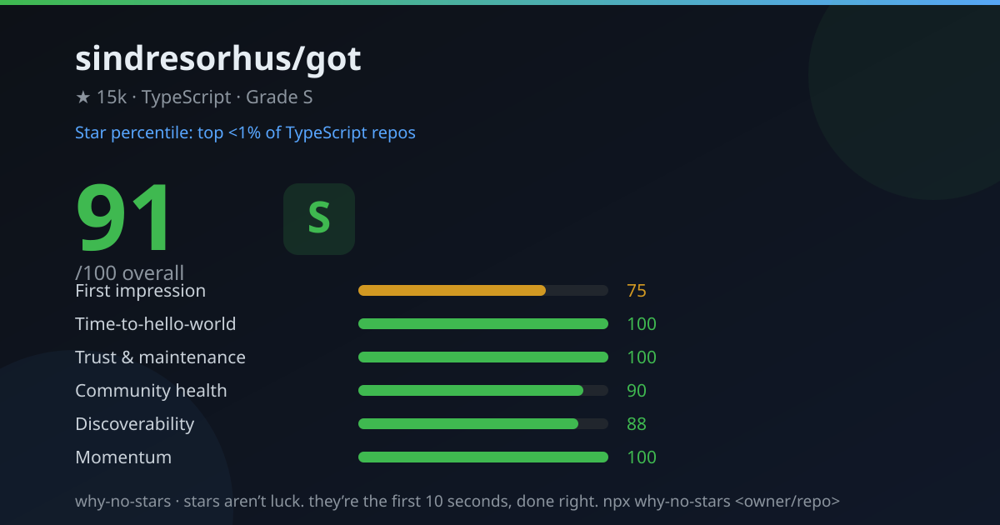

<div align="center">

# 🔍 why-no-stars

**精确诊断：你的 GitHub 仓库为什么没人 star。**

31 项带证据的检查 · 同语言生态 star 分位对比 · 一张可分享的评分卡。
零依赖、零配置、无需 API key。

[](https://github.com/paopaonb666/why-no-stars/actions/workflows/ci.yml)
[](./LICENSE)
[](./package.json)
[](./package.json)



[English](./README.md) · [中文](#中文)

</div>

---

<a name="中文"></a>

## 一句话介绍

你做了一个好东西，能跑、有测试、骄傲地推上 GitHub。然后它只有 **47 个 star**。

**你缺的不是运气，是"前 10 秒"。** 访客点进仓库、扫一眼、决定去留——`why-no-stars` 就是那个告诉你"他们到底卡在哪一步"的体检医生，而且每一项诊断都带证据，不是玄学：

```text
  ⚡ 最值得先做的三件事
  1. [HIGH] 安装命令靠近顶部
     第一条可复制的安装命令在第 62 行
     → 把安装命令提到 README 首屏
  2. [HIGH] 首屏有截图 / GIF / Demo 图
     整个 README 没有一张图片
     → 把截图放到 README 前 ~30 行
  3. [MED ] Issue 模板
     没有 issue 模板
     → 加 .github/ISSUE_TEMPLATE
```

每一条失败项都引用具体证据（"第 62 行"、"0 个徽章"、"214 天没提交"），你可以不同意诊断，但没法忽视它。

## 快速开始

```bash
# 免安装（直接从 GitHub 运行）
npx github:paopaonb666/why-no-stars <用户名/仓库>

# 或克隆后运行
git clone https://github.com/paopaonb666/why-no-stars && cd why-no-stars
node bin.js <用户名/仓库>
```

```bash
wns sindresorhus/got                 # 终端评分卡
wns 我的项目 --svg card.svg     # 1200×630 可分享评分卡
wns 我的项目 --md report.md     # 可直接贴到 issue 的 Markdown 报告
wns 我的项目 --zh               # 中文输出（中文环境自动生效）
```

> **无需 API key 也能跑。** 无 token 的 GitHub 限额是 60 次/小时（约 4 次体检）。
> 配置 `GITHUB_TOKEN` 后提升到 5000 次/小时。私有仓库加 token 同样可用。

## 六大支柱

| 支柱 | 权重 | 回答的问题 |
|---|---|---|
| **第一印象** | 25 | 陌生访客在前 10 秒会不会产生兴趣？ |
| **快速上手** | 20 | 从"有点兴趣"到"跑起来"要几步？ |
| **信任维护** | 20 | 这项目能放心用吗，还是数字废墟？ |
| **社区健康** | 15 | 第一批外部用户有没有路可以走进来？ |
| **曝光发现** | 10 | 搜相关关键词的人真的能搜到它吗？ |
| **增长势头** | 10 | 最近还有新东西进来吗，还是完全静止？ |

六大支柱共 **31 项检查**，每项都有：状态、证据、影响级别、具体修复动作。样例检查项：首屏安装命令、首屏配图、license、测试、CI、release 习惯、issue 模板、topics、star 增速、生态分位。

## 别处没有的指标：你的生态分位

对着抽象的最佳实践打分谁都会。`why-no-stars` 还会告诉你：**在你的语言的全部仓库里，你排在什么位置。** 它通过 GitHub 搜索 API 统计同主语言所有仓库的 star 分布（0、1–9、10–99、100–999、1k–10k、10k+ 六个桶），然后给出一个诚实的**区间**：

```text
expressjs/express: 91/100 (S) · 前 <1% 的同类仓库
```

只给区间不装精确——因为我们只知道你落在哪个桶里，不会编造精度。

## 一条命令拿全所有输出

```bash
wns 用户名/仓库 --svg scorecard.svg --json report.json --md report.md --zh
```

| 参数 | 作用 |
|---|---|
| `--svg <file>` | 1200×630 可分享评分卡（OG 图尺寸，README / 社交分享神器） |
| `--json <file>` | 机器可读报告（CI、看板） |
| `--md <file>` | Markdown 报告，可直接贴进 issue / discussion |
| `--zh` / `--en` | 输出语言（默认按 LANG 环境变量自动检测） |
| `--no-benchmark` | 跳过生态分位（省 6 次 API 调用） |
| `--token <t>` | GitHub token（默认读 `GITHUB_TOKEN` / `GH_TOKEN`） |
| `--quiet` | 只输出一行：分数 + 评级 + 分位 |

退出码：`0` 正常 · `1` 出错（仓库不存在等）· `2` 被限流。

## 实测：给一个著名仓库做体检

我们体检了 [`sindresorhus/got`](https://github.com/sindresorhus/got)——GitHub 上打磨最精致的仓库之一：

```text
  总分  91/100  [S]          生态分位：前 <1% 的 TypeScript 仓库

  第一印象     ████████░░   75  (w 25)
  快速上手     ██████████  100  (w 20)
  信任维护     ██████████  100  (w 20)
  社区健康     █████████░   90  (w 15)
  曝光发现     █████████░   88  (w 10)
  增长势头     ██████████  100  (w 10)

  ⚡ 最值得先做的三件事
  1. [HIGH] 首屏有截图 / GIF / Demo 图
     第一张图片在第 54 行
  2. [HIGH] 安装命令靠近顶部
     第一条可复制的安装命令在第 71 行
```

连 S 级仓库都能拿到具体可执行的改进项——这就对了，这不是虚荣分数。

## FAQ

**这不就是个 README linter 吗？**
不是。linter 检查文本；`why-no-stars` 诊断的是**转化率**：它把你和整个语言生态做分位对比、按预期收益给修复项排序、每个结论都带证据。

**分数有意义吗？**
分数是镜子，不是判决。六大支柱是资深维护者采用一个依赖前会看的信息，把它编码成了检查项。分数不会帮你写代码，但会告诉你：先做哪个 10 分钟的修复最划算。

**会伤到我的感情吗？**
可能会，评级最低到 **F**。建议的用法是：跑一次 → 修前三项 → 再跑一次。分数是待办清单，不是对你技术水平的审判。

**私有仓库？** 传个 token 就行，私有仓库照常体检。

**它会出错吗？** 会——它只是 GitHub API 之上的启发式规则，没有 LLM、没有魔法。错了就是 bug，欢迎[提 issue](https://github.com/paopaonb666/why-no-stars/issues)。

## 已知局限

- 全部发现都是启发式（正则 + API 元数据），完全离线、确定性运行，不会上传任何代码。
- 生态分位对比的是同主语言的 star 数量，暂未按仓库年龄归一化（在路线图上）。
- 超大仓库（>约 4 万 star）的"近期 star"数据来自公开事件流的采样下限，因为 GitHub 限制了 stargazers 深分页。

## 路线图

- [ ] `wns --local .` — 不走 API，直接体检本地目录
- [ ] 按年龄归一化的分位（与同期的仓库对比）
- [ ] `--watch` 模式：定时复查，追踪各支柱分数变化
- [ ] GitHub Action：README 变更时自动体检并评论
- [ ] 分支柱分位对比（与体量相近的同语言仓库样本）

## 参与贡献

Issue 和 PR 都欢迎，见 [CONTRIBUTING.md](./CONTRIBUTING.md)。加一个新检查只要 ~30 行：一个接收 facts 返回 `{ status, detail, fix, impact }` 的函数。[检查项注册表](./src/checks)刻意写得非常朴素。

## License

[MIT](./LICENSE) © 2026 paopaonb666

---

<div align="center">

**star 不是玄学，是前 10 秒的功夫。**

如果这个工具帮你的仓库找到了问题，就点个 star——你现在最清楚一颗 star 的价值了。 😉

</div>
